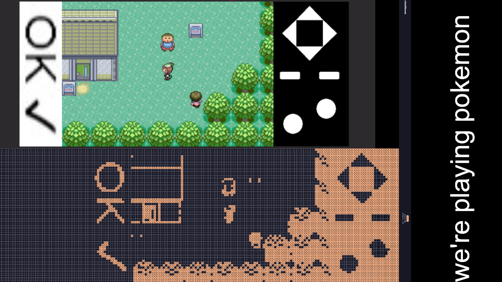

# checkbox-contraptions

 A list of all the fun stuff I made on OBCB

## Prerequisites

You need to do `npm install` in the directory.

The `startIndex`, referenced in many files is the index of
the pixel you are referring to.

+ Pixels go from *0* to *1073741823*.
+ There are *262144* pixels per page, and there are only *60* pixels in a row.
+ There are *4096* pages in total.

A formula to calculate the pixel would look something like:

```ts
const pixelsPerRow = 60;
const pixelsPerPage = 262144;
function getPixelInPage(row = 0, column = 0, page = 0) {
    const pixelWithinPage = (row * pixelsPerRow) + column;
    const pageStart = pixelsPerPage * page;
    const pixelIndex = pageStart + pixelWithinPage;
    return pixelIndex;
}
```

I think this should work, I think. I just hacked the javascript to show me the
  pixel indices of all checkboxes so I don't have to deal with this.

+ The recommended threshold is 128 for most stuff, but if your image has high
  contrast or is a black/white image,
  you can just go for a really high threshold value, maybe like 200-220.
  
+ You can play with the values, in most cases it is rendered in `./renders`
  so you can inspect it there.

## Contents

+ [My motive for all of this](#motive)
+ [Generating a single image](#generating-an-image-on-a-page-one-time)
+ [Generating a slideshow of images](#generating-a-slideshow-of-images)
+ [Generating a digital clock](#generating-a-digital-clock)
+ [Generating an infinite game of pong](#generating-an-infinite-game-of-pong)
+ [Generating a working tic-tac-toe](#generating-working-game-of-tic-tac-toe)
+ [Running a retro game emulator](#running-retro-game-emulators)
+ [Rendering images on the grand scale](#rendering-images-on-the-grand-scale)

## Generating an image on a page one time

+ Modify `run_generate_image.ts`, change the image, page, startIndex and other
  stuff according to whatever you need.
+ You will need to set the `page` that you are trying to draw on.
+ You will need to set the `startIndex`.
+ You will need to set an image path, and configure it's properties.
+ Run `npx tsx run_generate_image.ts`

<p align="center">

</p>

+ Ta-da! Image.

## Generating a slideshow of images

+ Like the previous one, inside `run_display.ts` has a list of images this time.

+ You follow all the steps above.

+ There's a lot of last-moment features in here since I was attempting to combat
  trolls.

+ If you toggle `combat_mode`, it will continuously re-render the image. This
  isn't very efficient on it's own, but it does it's best, and is probably more
  effective with about 5 of these proceses running at once, in sync. I won't be
  providing code for that though.

+ `shuffleEnabled` shuffles the order of the display.

+ Putting an array of strings instead of a string for the image name is going to
  make it either randomly pick one or continuously render them all one by one.

+ Putting "random" for invert will make the `invert` property become randomized.

<p align="center">

</p>

## Generating a digital clock

+ Add in your `startIndex` and `page`
+ Run `npx tsx run_clock_websocket.ts`

<p align="center">

</p>

This is obviously a sped-up version but you get the idea.

## Generating an infinite game of pong

+ Go to `ponggame`, run `npm start`
+ In another terminal or your server, go to directory root `.` and modify
  `run_pong_websocket.ts` with your `startIndex` and `page`
+ Run `npx tsx run_pong_websocket.ts`
+ As long as your terminal is open, an infinite game of pong is generated.

<p align="center">

</p>

## Generating working game of tic-tac-toe

+ Modify `run_tic_tac_toe_websocket.ts` with your `startIndex` and `page`.
+ Run `npx tsx run_tic_tac_toe_websoocket.ts`

<p align="center">

</p>

## Running retro game emulators

Inside the `retrobot` directory is a modified fork of the [retrobot](https://github.com/rossimo/retrobot)
emulator discord bot.

### 1: How to run your own retro game

+ Add a game of extension `.gb`, `.gba` or `.nes` into the `./games` directory.

+ Open up `run_pokemon_ts`.  Modify the `startIndex`, `page` and `game`.

+ Depending on the game, you will want to modify the `threshold`.
  Different thresholds work well for different games.

+ There are 2 modes to this, horizontal and vertical. Change the `gameHorizontal`
  property to your liking.

+ Run `npm run start-pokemon`

We've played actual games on the emulator!

+ Pokemon looked like this

<p align="center">

</p>

+ But I recommend Bomberman, it works best for the low resolution:

<p align="center">

</p>

### 2: Run tetris, it works great

+ I have optimized tetris to work with portait mode on this website.
+ Add the `Nintendo Entertainment System (NES) Tetris` rom into the `games` directory.
+ Open up `runtetris.ts`, modify the same as above.
+ Run `npm run start-tetris`

<p align="center">

</p>

### 3: Make tetris play by itself

This does not actually play tetris by itself, but the original NES Tetris comes
with a built-in auto-play screensaver, which plays games of tetris seemingly
on it's own (even though it's likely pre-recorded).

+ Do the same steps as above for `runtetrisauto.ts`

## Rendering images on the grand scale

Like the original OMCB, this repository has code to render and draw on
a 32768 x 32768 pixel square.

### Rendering the square

+ Go to the `py` directory and run
  `python -m pip install websocket-client pillow numpy`

+ Run `python read_and_generate_map.py`

+ This will take a considerable amount of memory usage. You'll need at least 4+
  gigabytes of RAM free.

+ You can choose to create a `dump` file to read from there instead of making requests
  to the server next time. However, dump files are 1 gigabyte big.

+ The rendered output is saved in `square_image.png` and looks like this:

<p align="center">

</p>

### Drawing on the large scale

Here comes the tricky part, I never actually solved this myself.
I came up with a hacky fix and I'm still disappointed in the way that it works.
I wouldn't consider this a reliable method but I no longer have the patience to
fix this.

#### 1: Dither an image

+ Modify `generate_dithered_image.ts` to link to your `.png` image and modify
  the threshold.
+ Run `npx tsx generate_dithered_image.ts`.
+ The resulting image will appear in `./renders/render_dither_grayscale.png`

<p align="center">

</p>

#### 2: Draw the image

+ Open up `run_generate_image_big.ts`

+ Change the `startIndex`, `imagePath`, `imageInvert`, `imageThreshold`

+ You can run `run_generate_whatdoesitlooklike.ts` with the same settings
  to see what the resulting image will look like. Keep `increaseHeight` to
  false to see it normally, true to see it's true elongated state at which it
  is rendered.

+ Decide on the width of the image in `widthImage`. Remember that the canvas
  is 32k x 32k.

+ The most important step is to find the right `targetHeightMultiplier`.

This is a weird thing that was introduced because I might've messed up my math,
but GPT couldn't find the problem either so I gave up.

1) For a 1k x 1k image, the multiplier can be left at 1.
2) For a 5k x 5k image, the multiplier must go to 6 (or 6.5 also works).
3) For a 5k x 2.7k image, the multiplier can be 4 (or 4.5 is better).
4) For a 5k x 6.3k image, the multiplier must go to 7 or 7.5.

+ You see this weird pattern? I don't get it. Why does multiplying the height by
such weird amounts give us the correct image we need on the board? I'll never know.

+ `leaveUnfilledBlank` will not touch pixels that are of "unfilled" / 0 / white colour.

+ Run `npx tsx run_generate_image_big.ts`

+ After that you're done. You're going to want to re-render the board to see
  your result.

+ Here's what mine looked like

<p align="center">

</p>

## Motive

There was a popular website called [One Million Checkboxes (OMCB)](https://onemillioncheckboxes.com/).
It was wow-ed at for it's ability to handle the state of a million checkboxes in
real-time.

Later, the creator made [this video](https://www.youtube.com/watch?v=OI4DbECnp8A),
where he mentioned that a group of teenagers made art out of checkboxes.
I missed it, and I probably never would've found it, but I found
[One Billion Checkboxes](https://checkbox.ing/), it was made by someone in the
same server that orchestrated the OMCB artists' operations.

Then, I immediately got to work to recreate what I would've had I laid my hands
on OMCB. Out of excitement, I wrote this rushed
[gist about how I found this super cool alternative site](https://gist.github.com/SuppliedOrange/600c873d44d4671f0e215b38fe9cf62c).

And then, in a matter of a week or two, here I am, sharing the cool stuff I made
on OBCB. I'm especially glad for the friends I made while making these silly projects,
alongside the trolls I met that sabotaged me. It was short, but it was nice.
